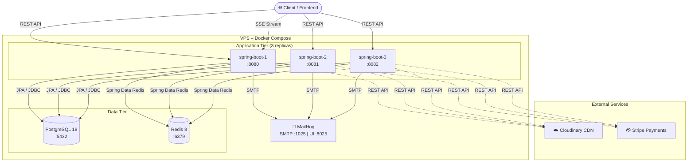
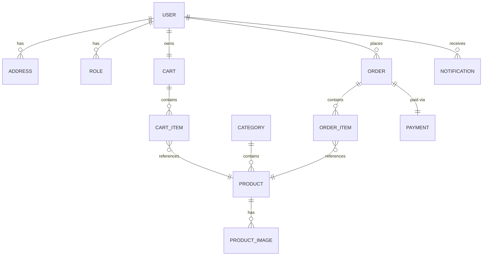
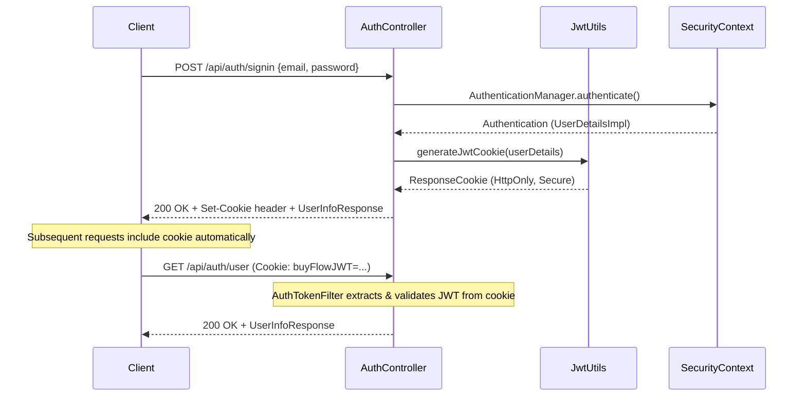
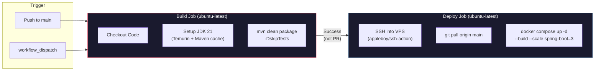

# 🛒 sb-ecom — Spring Boot E-Commerce Platform

A production-ready, multi-role e-commerce backend built with **Spring Boot 4.1**, **Java 21**, and a fully containerized Docker stack. Features JWT cookie-based authentication, Stripe payments, Cloudinary media uploads, Redis caching, real-time SSE notifications, and automated CI/CD deployment to a VPS.

---

## Table of Contents

- [Architecture Overview](#architecture-overview)
- [Tech Stack](#tech-stack)
- [Project Structure](#project-structure)
- [Domain Model](#domain-model)
- [API Reference](#api-reference)
- [Authentication & Authorization](#authentication--authorization)
- [Caching Strategy](#caching-strategy)
- [Real-Time Notifications](#real-time-notifications)
- [Docker Setup](#docker-setup)
- [CI/CD Pipeline](#cicd-pipeline)
- [Environment Variables](#environment-variables)
- [Local Development](#local-development)
- [Database Backup & Restore](#database-backup--restore)

---

## Architecture Overview

The application follows a **layered architecture** (Controller → Service → Repository) with a multi-container Docker deployment scaled to **3 Spring Boot replicas** behind shared infrastructure services.



### Key Design Decisions

| Decision | Rationale |
|---|---|
| **3 app replicas** | Horizontal scaling for concurrent request handling; each replica gets a dedicated host port (8080–8082) |
| **JWT in HTTP-only cookies** | More secure than localStorage tokens — immune to XSS attacks |
| **Redis caching (60 min TTL)** | Reduces database load for frequently accessed product/category data |
| **SSE (Server-Sent Events)** | Lightweight real-time push for seller notifications without WebSocket overhead |
| **Multi-stage Docker build** | Build stage uses Maven+JDK, runtime stage uses JRE-only Alpine — produces a minimal image |
| **MailHog for dev email** | Catches all outgoing mail in development without sending real emails |

---

## Tech Stack

| Layer | Technology | Version |
|---|---|---|
| **Runtime** | Java (Eclipse Temurin) | 21 |
| **Framework** | Spring Boot | 4.1.0 |
| **Web** | Spring MVC + Spring WebFlux | — |
| **Security** | Spring Security + JWT (jjwt) | 0.13.0 |
| **Persistence** | Spring Data JPA + Hibernate | — |
| **Database** | PostgreSQL (production) / H2 (dev console) | 18.4 |
| **Caching** | Spring Cache + Redis | 8 |
| **Payments** | Stripe Java SDK | 33.2.0 |
| **Media Storage** | Cloudinary HTTP5 SDK | 2.0.0 |
| **Email** | Spring Mail + MailHog | — |
| **Object Mapping** | ModelMapper | 3.2.4 |
| **Boilerplate** | Lombok | — |
| **Validation** | Jakarta Bean Validation | — |
| **Build** | Maven (with wrapper) | 3.9 |
| **Containerization** | Docker + Docker Compose | — |
| **CI/CD** | GitHub Actions | — |

---

## Project Structure

```
sb-ecom/
├── .github/
│   └── workflows/
│       └── deploy.yaml              # CI/CD pipeline definition
├── docker/
│   └── postgres/
│       └── ecommerce_backup.sql     # Database seed / backup
├── src/main/java/com/ecommerce/project/
│   ├── SbEcomApplication.java       # Application entry point
│   ├── config/
│   │   ├── AppConfig.java           # ModelMapper bean
│   │   ├── AppConstants.java        # Pagination defaults
│   │   ├── CloudinaryConfig.java    # Cloudinary client setup
│   │   ├── DataInitializer.java     # Seeds default roles on first run
│   │   ├── RedisCachingConfig.java  # Cache manager with JSON serialization
│   │   └── StripeConfig.java        # Stripe API key config
│   ├── controller/
│   │   ├── AuthController.java      # Sign-in, sign-up, sign-out, current user
│   │   ├── ProductController.java   # CRUD, search, image upload
│   │   ├── CategoryController.java  # Category management
│   │   ├── CartController.java      # Cart operations
│   │   ├── OrderController.java     # Order placement & tracking
│   │   ├── PaymentController.java   # Stripe payment intents
│   │   ├── AddressController.java   # User address management
│   │   ├── UserController.java      # User profile
│   │   ├── SellerController.java    # Seller-specific operations
│   │   └── NotificationController.java  # SSE subscription + history
│   ├── model/                       # JPA entities
│   │   ├── User.java, Role.java
│   │   ├── Product.java, ProductImage.java, Category.java
│   │   ├── Cart.java, CartItem.java
│   │   ├── Order.java, OrderItem.java
│   │   ├── Payment.java
│   │   ├── Address.java
│   │   └── Notification.java
│   ├── repositories/                # Spring Data JPA repositories
│   ├── services/                    # Business logic layer
│   │   ├── *Service.java            # Interfaces
│   │   ├── *ServiceImpl.java        # Implementations
│   │   ├── CloudinaryService.java   # Image upload/delete
│   │   ├── PaymentService.java      # Stripe integration
│   │   ├── EmailService.java        # Transactional emails
│   │   └── SseEmitterService.java   # Real-time push notifications
│   ├── security/
│   │   ├── WebSecurityConfig.java   # Security filter chain
│   │   ├── jwt/
│   │   │   ├── JwtUtils.java        # Token generation & validation
│   │   │   ├── AuthTokenFilter.java # JWT cookie extraction filter
│   │   │   └── AuthEntryPointJwt.java
│   │   ├── Authorization/
│   │   │   └── ProductSecurity.java # Method-level product ownership checks
│   │   ├── services/
│   │   │   ├── UserDetailsImpl.java
│   │   │   └── UserDetailsServiceImpl.java
│   │   ├── requests/                # Login/Signup DTOs
│   │   └── responses/               # Auth response DTOs
│   ├── payload/                     # Request/Response DTOs
│   ├── enums/
│   │   ├── AppRole.java             # ROLE_USER, ROLE_SELLER, ROLE_ADMIN
│   │   ├── OrderStatus.java         # PENDING_PAYMENT → DELIVERED lifecycle
│   │   ├── PaymentStatus.java
│   │   └── NotificationType.java    # NEW_ORDER, ORDER_CANCELLED, etc.
│   ├── exceptions/                  # Global exception handling
│   └── utils/
│       └── AuthUtils.java           # Current user extraction helpers
├── src/main/resources/
│   ├── application.properties       # App configuration
│   └── templates/                   # Email templates
├── Dockerfile                       # Multi-stage build
├── docker-compose.yml               # Full stack orchestration
├── pom.xml                          # Maven dependencies
└── .env                             # Environment variables (DO NOT COMMIT)
```

---

## Domain Model



### Roles & Permissions

| Role | Capabilities |
|---|---|
| `ROLE_USER` | Browse products, manage cart, place orders, manage addresses |
| `ROLE_SELLER` | All user capabilities + manage own products, receive order notifications |
| `ROLE_ADMIN` | Full system access including category management and user oversight |

### Order Lifecycle

```
PENDING_PAYMENT → PAID → PROCESSING → SHIPPED → DELIVERED
                                                    ↘ CANCELLED
                                                    ↘ REFUNDED
                  ↘ PAYMENT_FAILED
```

---

## API Reference

### Authentication (`/api/auth`)

| Method | Endpoint | Description | Auth Required |
|---|---|---|---|
| `POST` | `/api/auth/signup` | Register a new user | ❌ |
| `POST` | `/api/auth/signin` | Login (returns JWT cookie) | ❌ |
| `POST` | `/api/auth/signout` | Logout (clears JWT cookie) | ✅ |
| `GET` | `/api/auth/user` | Get current user info | ✅ |
| `GET` | `/api/auth/username` | Get current username | ✅ |

### Products

| Method | Endpoint | Description |
|---|---|---|
| `GET` | `/api/public/products` | List all products (paginated) |
| `GET` | `/api/public/categories/{id}/products` | Products by category |
| `GET` | `/api/public/products/keyword/{keyword}` | Search products |
| `POST` | `/api/admin/products` | Create product (Seller/Admin) |
| `PUT` | `/api/admin/products/{id}` | Update product |
| `DELETE` | `/api/admin/products/{id}` | Delete product |
| `PUT` | `/api/products/{id}/image` | Upload product image (Cloudinary) |

### Categories

| Method | Endpoint | Description |
|---|---|---|
| `GET` | `/api/public/categories` | List all categories |
| `POST` | `/api/admin/categories` | Create category (Admin) |
| `PUT` | `/api/admin/categories/{id}` | Update category |
| `DELETE` | `/api/admin/categories/{id}` | Delete category |

### Cart

| Method | Endpoint | Description |
|---|---|---|
| `POST` | `/api/cart/products/{productId}/quantity/{quantity}` | Add to cart |
| `PUT` | `/api/cart/products/{productId}/quantity/{operation}` | Update quantity |
| `DELETE` | `/api/cart/{cartId}/product/{productId}` | Remove from cart |
| `GET` | `/api/carts` | Get user's cart |

### Orders

| Method | Endpoint | Description |
|---|---|---|
| `POST` | `/api/order/users/payments/{paymentMethod}` | Place order |
| `GET` | `/api/order` | Get user's orders |

### Payments

| Method | Endpoint | Description |
|---|---|---|
| `POST` | `/api/payments/create-payment-intent` | Create Stripe PaymentIntent |

### Notifications (SSE)

| Method | Endpoint | Description |
|---|---|---|
| `GET` | `/api/notifications/subscribe` | Subscribe to SSE stream |
| `GET` | `/api/notifications` | Get notification history |
| `PATCH` | `/api/notifications/{id}/read` | Mark as read |

### Addresses & Users

| Method | Endpoint | Description |
|---|---|---|
| `POST` | `/api/addresses` | Add address |
| `GET` | `/api/addresses` | Get user's addresses |
| `PUT` | `/api/addresses/{id}` | Update address |
| `DELETE` | `/api/addresses/{id}` | Delete address |

---

## Authentication & Authorization

The application uses **JWT tokens stored in HTTP-only secure cookies** — not Bearer tokens in headers.



**Security highlights:**
- Passwords hashed with BCrypt via `PasswordEncoder`
- JWT secret configured via environment variable (`JWT_SECRET`)
- Token expiration configurable (`JWT_EXPIRATION_MS`, default 24h)
- Method-level authorization checks (e.g., `ProductSecurity` for ownership validation)
- Roles seeded automatically on first startup via `DataInitializer`

---

## Caching Strategy

Redis is configured as a centralized cache with **JSON serialization** and a **60-minute TTL**:

```
Client Request
     │
     ▼
┌─────────────┐    Cache HIT     ┌───────────┐
│  Service     │ ───────────────► │   Redis   │
│  Layer       │                  │  (60min)  │
│ (@Cacheable) │ ◄─────────────── │           │
└──────┬───────┘    Return data   └───────────┘
       │
       │ Cache MISS
       ▼
┌─────────────┐
│ PostgreSQL  │
│  Database   │
└─────────────┘
```

- **Serialization**: `GenericJacksonJsonRedisSerializer` with polymorphic type support
- **Key format**: String-serialized
- **Null values**: Caching of null values is disabled
- **Cache invalidation**: Handled via `@CacheEvict` on write operations

---

## Real-Time Notifications

Sellers receive instant push notifications for order events via **Server-Sent Events (SSE)**:

| Event | Trigger |
|---|---|
| `NEW_ORDER` | Customer places an order for the seller's product |
| `ORDER_CANCELLED` | Customer cancels an order |
| `RETURN_REQUESTED` | Customer requests a return |
| `PAYMENT_FAILED` | Payment processing fails |

**Implementation details:**
- Per-user `ConcurrentHashMap<Long, List<SseEmitter>>` allows multiple tabs/devices
- 30-minute SSE connection timeout with automatic cleanup
- Notifications are persisted to the database for offline users and retrieval history
- Thread-safe via `CopyOnWriteArrayList`

---

## Docker Setup

### Multi-Stage Dockerfile

```dockerfile
# Stage 1: Build — Maven + JDK 21 Alpine
FROM maven:3.9-eclipse-temurin-21-alpine AS build
WORKDIR /app
COPY pom.xml .
RUN mvn dependency:go-offline -B     # Cache dependencies
COPY ./src ./src
RUN mvn clean package -DskipTests

# Stage 2: Runtime — JRE-only Alpine (minimal image)
FROM eclipse-temurin:21-jre-alpine
WORKDIR /app
COPY --from=build /app/target/*.jar app.jar
EXPOSE 8080
ENTRYPOINT ["java", "-jar", "app.jar"]
```

### Docker Compose Services

| Service | Image | Ports | Purpose |
|---|---|---|---|
| `spring-boot` (×3) | Custom (built from Dockerfile) | `8080-8082:8080` | Application replicas |
| `postgres` | `postgres:18.4-alpine` | Internal only | Primary database |
| `redis` | `redis:8-alpine` | `6379:6379` | Caching layer |
| `mailhog` | `mailhog/mailhog` | `1025` (SMTP), `8025` (UI) | Email testing |

### Network

All services communicate over a shared Docker bridge network (`spring-net`). Service names are used as hostnames (e.g., `postgres`, `redis`, `mailhog`).

### Quick Start

```bash
# 1. Clone the repository
git clone https://github.com/Abdellah0x1/springEcomApp.git
cd springEcomApp

# 2. Configure environment variables
cp .env.example .env    # Edit with your actual values

# 3. Build and start all services (3 replicas)
docker compose up -d --build

# 4. Verify all containers are running
docker compose ps

# 5. Access the API
curl http://localhost:8080/api/public/products
```

### Useful Commands

```bash
# View logs from all spring-boot replicas
docker compose logs -f spring-boot

# Restart only the application (keep database data)
docker compose restart spring-boot

# Stop everything
docker compose down

# Stop and destroy all data (including Postgres volume)
docker compose down -v

# Rebuild after code changes
docker compose up -d --build
```

### Accessing MailHog

Open [http://localhost:8025](http://localhost:8025) in your browser to view all captured emails sent by the application.

---

## CI/CD Pipeline

The project uses **GitHub Actions** with a two-stage pipeline triggered on pushes to `main`.



### Pipeline Stages

#### 1. Build (`build` job)
- **Runs on**: `ubuntu-latest`
- **Triggers**: Push to `main`, pull requests to `main`, manual dispatch
- **Steps**:
  1. Checkout repository (`actions/checkout@v4`)
  2. Setup JDK 21 Temurin with Maven dependency caching (`actions/setup-java@v4`)
  3. Build the project: `./mvnw clean package -DskipTests`

#### 2. Deploy (`deploy` job)
- **Runs on**: `ubuntu-latest`
- **Condition**: Only runs after a successful build **AND** not on pull requests
- **Steps**:
  1. SSH into the VPS using `appleboy/ssh-action@v1`
  2. Pull latest code: `git pull origin main`
  3. Rebuild and deploy: `docker compose up -d --build --scale spring-boot=3`

### Required GitHub Secrets

| Secret | Description |
|---|---|
| `VPS_HOST` | IP address or hostname of the deployment server |
| `VPS_USER` | SSH username on the VPS |
| `VPS_SSH_KEY` | Private SSH key for passwordless authentication |

### Deployment Path on VPS

```
/opt/spring-ecommerce/backend/    # Git repo clone on the server
```

### Rolling Deployment Behavior

Docker Compose recreates containers one-by-one when scaling, meaning:
- Existing replicas continue serving traffic while new ones are built
- Brief downtime may occur per-replica during container recreation
- Database and Redis containers are **not** rebuilt (only the `spring-boot` service is)

---

## Environment Variables

Create a `.env` file in the project root (or configure as GitHub Secrets for CI/CD):

| Variable | Description | Example |
|---|---|---|
| `POSTGRES_DB` | PostgreSQL database name | `ecommerce` |
| `POSTGRES_USER` | PostgreSQL username | `postgres` |
| `POSTGRES_PASSWORD` | PostgreSQL password | `your_secure_password` |
| `JWT_SECRET` | Base64 secret for signing JWTs | `gk7D2pEBeq2HOBj48Im...` |
| `JWT_EXPIRATION_MS` | Token lifetime in milliseconds | `86400000` (24 hours) |
| `JWT_COOKIE` | Name of the JWT cookie | `buyFlowJWT` |
| `CLOUDINARY_KEY` | Cloudinary API key | `183291723212937` |
| `CLOUDINARY_SECRET` | Cloudinary API secret | `SH7KB9CTXCiF...` |
| `CLOUDINARY_CLOUD_NAME` | Cloudinary cloud name | `dcw6rqiaz` |
| `STRIPE_SECRET_KEY` | Stripe secret key (`sk_test_...`) | `sk_test_51Tzz...` |
| `STRIPE_WEBHOOK_SECRET` | Stripe webhook signing secret | `whsec_1e808...` |

> ⚠️ **Never commit `.env` to version control.** Add it to `.gitignore`.

---

## Local Development

### Prerequisites
- **Java 21** (Temurin recommended)
- **Maven 3.9+** (or use the included `mvnw` wrapper)
- **Docker & Docker Compose**

### Running Without Docker (app only)

If you want to run just the Spring Boot app locally while using Docker for infrastructure:

```bash
# Start only database and cache services
docker compose up -d postgres redis mailhog

# Run the application with Maven
./mvnw spring-boot:run
```

> **Note**: Update `application.properties` to point to `localhost` instead of Docker service names (`postgres` → `localhost`, `redis` → `localhost`, `mailhog` → `localhost`).

### Running Tests

```bash
# Run all tests
./mvnw test

# Run tests with verbose output
./mvnw test -X
```

### Building the JAR

```bash
# Build without running tests
./mvnw clean package -DskipTests

# Build with tests
./mvnw clean package
```

---

## Database Backup & Restore

A SQL backup is included at `docker/postgres/ecommerce_backup.sql`.

### Create a Backup

```bash
docker compose exec postgres pg_dump -U postgres ecommerce > docker/postgres/ecommerce_backup.sql
```

### Restore from Backup

```bash
docker compose exec -T postgres psql -U postgres ecommerce < docker/postgres/ecommerce_backup.sql
```

---

## License

This project is for educational and portfolio purposes.
