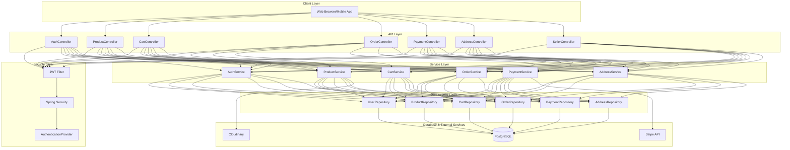
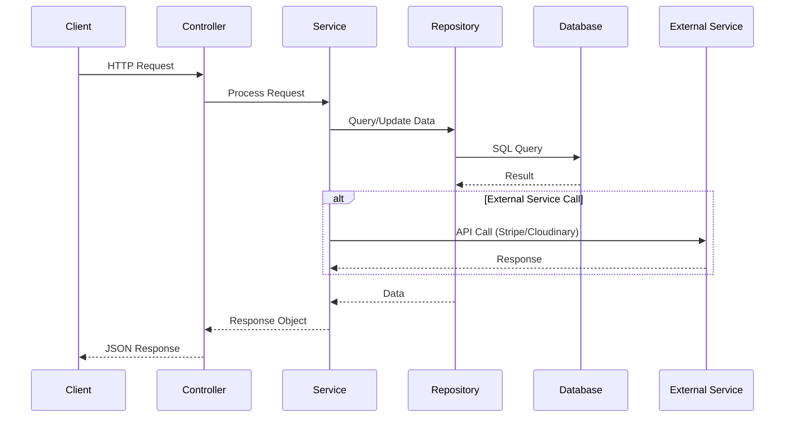
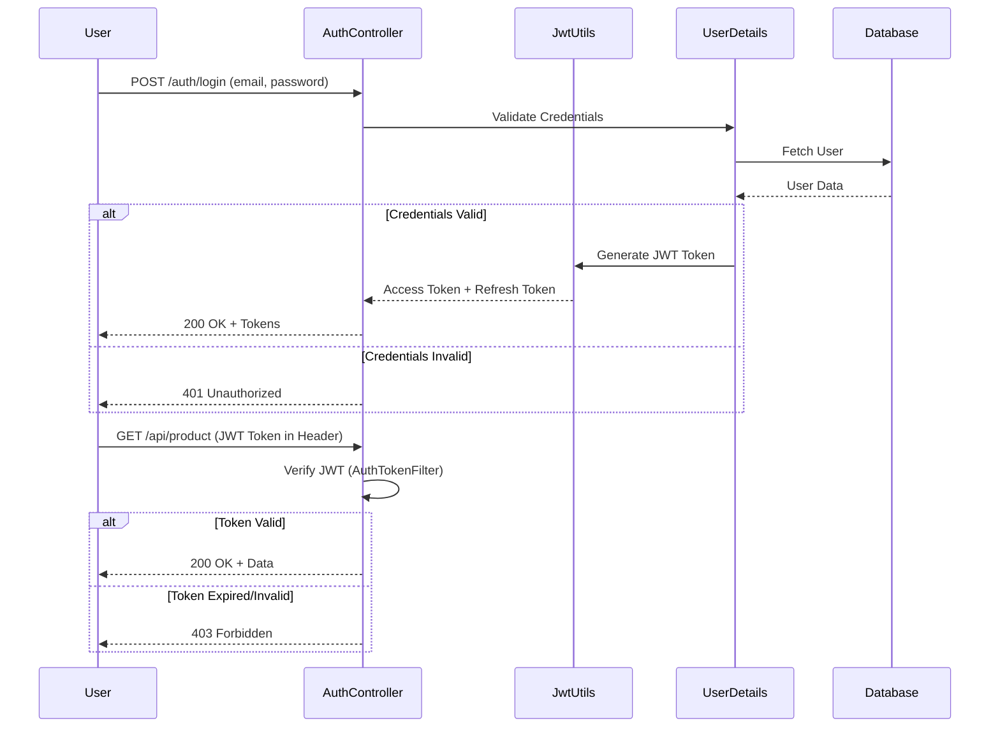

# SB-Ecom: Spring Boot E-Commerce Platform

A modern, scalable e-commerce platform built with Spring Boot 4.1, featuring JWT authentication, product management, cart functionality, order processing, and payment integration.

## 🚀 Features

- **User Authentication & Authorization**: JWT-based authentication with role-based access control (Admin, Seller, Customer)
- **Product Management**: Full CRUD operations with image support via Cloudinary
- **Shopping Cart**: Add/remove items, manage quantities
- **Order Management**: Order creation, tracking, and status management
- **Payment Processing**: Integrated with Stripe for secure payment handling
- **Address Management**: Multiple address support for users
- **Notifications**: Order and transaction notifications
- **Security**: JWT tokens, Spring Security, password validation
- **File Management**: Cloudinary integration for image uploads
- **Docker Support**: Containerized deployment with PostgreSQL

## 🛠️ Tech Stack

### Backend
- **Framework**: Spring Boot 4.1
- **Language**: Java 21
- **Build Tool**: Maven
- **ORM**: Spring Data JPA & Hibernate
- **Security**: Spring Security + JWT (JJWT 0.13.0)

### Database
- **Primary**: PostgreSQL 18.4
- **Development/Testing**: H2 Database
- **Supported**: MySQL 8.0+

### External Services
- **Payment Processing**: Stripe Java SDK (v33.2.0)
- **Cloud Storage**: Cloudinary (Image Management)
- **Object Mapping**: ModelMapper (v3.2.4)

### Utilities
- **Validation**: Spring Boot Validation Starter
- **Lombok**: Code generation & reduction
- **Testing**: Spring Boot Test + Spring Security Test

### DevOps
- **Containerization**: Docker + Docker Compose
- **Base Image**: Eclipse Temurin 21 JRE Alpine
- **Port**: 8080 (default)

## 📊 Architecture

### System Architecture



### Data Model

```mermaid
erDiagram
    USER ||--o{ ADDRESS : has
    USER ||--o{ CART : owns
    USER ||--o{ ORDER : places
    USER ||--o{ PAYMENT : makes
    PRODUCT ||--o{ PRODUCT_IMAGE : contains
    PRODUCT ||--o{ CART_ITEM : "added to"
    PRODUCT ||--o{ ORDER_ITEM : "included in"
    CATEGORY ||--o{ PRODUCT : contains
    CART ||--o{ CART_ITEM : contains
    ORDER ||--o{ ORDER_ITEM : contains
    ORDER ||--o{ PAYMENT : has
    ROLE ||--o{ USER : "assigned to"
    NOTIFICATION ||--o{ USER : "sent to"

    USER {
        long userId PK
        string email UK
        string password
        string firstName
        string lastName
        boolean enabled
        role_id FK
    }
    
    ADDRESS {
        long addressId PK
        long userId FK
        string street
        string city
        string state
        string country
        string zipCode
    }
    
    CATEGORY {
        long categoryId PK
        string categoryName UK
        string description
    }
    
    PRODUCT {
        long productId PK
        string productName
        string description
        long categoryId FK
        double price
        long quantity
        double discount
        long userId FK
    }
    
    PRODUCT_IMAGE {
        long imageId PK
        string imageFileName
        string imagePath
        long productId FK
    }
    
    CART {
        long cartId PK
        double totalPrice
        long userId FK
    }
    
    CART_ITEM {
        long cartItemId PK
        long productId FK
        long cartId FK
        long quantity
        double discount
    }
    
    ORDER {
        long orderId PK
        long userId FK
        long addressId FK
        string orderStatus
        date orderDate
        double totalAmount
    }
    
    ORDER_ITEM {
        long orderItemId PK
        long orderId FK
        long productId FK
        long quantity
        double discount
    }
    
    PAYMENT {
        long paymentId PK
        long orderId FK
        string paymentMethod
        string paymentStatus
        date paymentDate
    }
    
    ROLE {
        long roleId PK
        string roleName
    }
    
    NOTIFICATION {
        long notificationId PK
        long userId FK
        string message
        string type
        boolean read
    }
```

### Request/Response Flow



### Authentication Flow



## 📁 Project Structure

```
sb-ecom/
├── src/main/java/com/ecommerce/project/
│   ├── controller/           # REST API Controllers
│   │   ├── AuthController
│   │   ├── ProductController
│   │   ├── CartController
│   │   ├── OrderController
│   │   ├── PaymentController
│   │   ├── AddressController
│   │   └── SellerController
│   ├── services/             # Business Logic
│   │   ├── AuthService
│   │   ├── ProductService
│   │   ├── CartService
│   │   ├── OrderService
│   │   ├── PaymentService
│   │   ├── AddressService
│   │   └── CloudinaryService
│   ├── model/               # JPA Entities
│   │   ├── User
│   │   ├── Product
│   │   ├── Cart
│   │   ├── Order
│   │   ├── Payment
│   │   ├── Address
│   │   ├── Category
│   │   ├── Role
│   │   ├── Notification
│   │   └── ...
│   ├── repositories/        # Data Access Layer
│   │   └── *Repository (Spring Data JPA)
│   ├── security/            # JWT & Security Config
│   │   ├── jwt/
│   │   │   ├── JwtUtils
│   │   │   ├── AuthTokenFilter
│   │   │   └── AuthEntryPointJwt
│   │   ├── services/
│   │   ├── requests/
│   │   └── WebSecurityConfig
│   ├── payload/             # DTOs
│   │   └── *DTO
│   ├── config/              # Configuration Classes
│   │   ├── AppConfig
│   │   ├── CloudinaryConfig
│   │   ├── StripeConfig
│   │   └── DataInitializer
│   ├── enums/               # Enumeration Classes
│   │   ├── AppRole
│   │   ├── OrderStatus
│   │   └── PaymentStatus
│   ├── exceptions/          # Custom Exceptions
│   │   ├── APIException
│   │   ├── ResourceNotFoundException
│   │   └── myGlobalExceptionHandler
│   └── utils/               # Utility Classes
├── docker-compose.yml       # Docker services configuration
├── Dockerfile              # Application container image
├── pom.xml                 # Maven dependencies
└── README.md              # This file
```

## 🚦 Getting Started

### Prerequisites

- **Java**: JDK 21+
- **Maven**: 3.8.0+
- **Docker & Docker Compose**: For containerized setup
- **PostgreSQL**: 18.4+ (or MySQL 8.0+)

### Local Setup

1. **Clone the repository**
   ```bash
   git clone <repository-url>
   cd sb-ecom
   ```

2. **Configure Database**
   - Update `application.properties` or `application.yml` with your database credentials:
   ```properties
   spring.datasource.url=jdbc:postgresql://localhost:5432/ecommerce
   spring.datasource.username=postgres
   spring.datasource.password=your_password
   ```

3. **Set up Environment Variables**
   ```properties
   # Stripe Configuration
   stripe.api.key=your_stripe_api_key
   
   # Cloudinary Configuration
   cloudinary.cloud_name=your_cloud_name
   cloudinary.api_key=your_api_key
   cloudinary.api_secret=your_api_secret
   
   # JWT Secret
   jwt.secret=your_jwt_secret_key
   jwt.expiration=86400000  # 24 hours in milliseconds
   ```

4. **Build the Project**
   ```bash
   mvn clean install
   ```

5. **Run the Application**
   ```bash
   mvn spring-boot:run
   ```
   Application will be available at `http://localhost:8080`

### Docker Setup

1. **Build and Start Services**
   ```bash
   docker-compose up --build
   ```
   - Spring Boot application runs on `http://localhost:8080`
   - PostgreSQL runs on `localhost:5432`

2. **Stop Services**
   ```bash
   docker-compose down
   ```

3. **View Logs**
   ```bash
   docker-compose logs -f spring-boot
   ```

## 📚 API Endpoints

### Authentication
- `POST /api/auth/signup` - Register new user
- `POST /api/auth/login` - Login and get JWT token
- `POST /api/auth/refresh` - Refresh access token

### Products
- `GET /api/products` - Get all products (with pagination/filtering)
- `GET /api/products/{id}` - Get product details
- `POST /api/products` - Create product (Seller/Admin)
- `PUT /api/products/{id}` - Update product (Seller/Admin)
- `DELETE /api/products/{id}` - Delete product (Seller/Admin)

### Categories
- `GET /api/categories` - Get all categories
- `POST /api/categories` - Create category (Admin)
- `PUT /api/categories/{id}` - Update category (Admin)
- `DELETE /api/categories/{id}` - Delete category (Admin)

### Cart
- `GET /api/cart` - Get current user's cart
- `POST /api/cart/items` - Add item to cart
- `PUT /api/cart/items/{id}` - Update cart item
- `DELETE /api/cart/items/{id}` - Remove item from cart
- `DELETE /api/cart` - Clear cart

### Orders
- `POST /api/orders` - Create new order
- `GET /api/orders` - Get user's orders
- `GET /api/orders/{id}` - Get order details
- `PUT /api/orders/{id}/status` - Update order status (Admin)
- `DELETE /api/orders/{id}` - Cancel order

### Payments
- `POST /api/payments/intent` - Create payment intent (Stripe)
- `POST /api/payments` - Process payment
- `GET /api/payments/{id}` - Get payment details

### Address
- `GET /api/addresses` - Get user's addresses
- `POST /api/addresses` - Add new address
- `PUT /api/addresses/{id}` - Update address
- `DELETE /api/addresses/{id}` - Delete address

### Seller
- `GET /api/seller/products` - Get seller's products
- `GET /api/seller/orders` - Get seller's orders

## 🔐 Security

- **JWT Authentication**: Stateless token-based authentication
- **Role-Based Access Control**: Admin, Seller, Customer roles
- **Password Hashing**: Spring Security's BCryptPasswordEncoder
- **CORS Configuration**: Configurable cross-origin resource sharing
- **HTTPS**: Recommended for production deployment
- **Input Validation**: Spring Validation annotations on DTOs

## 🧪 Testing

Run tests with Maven:
```bash
mvn test
```

## 📝 Environment Configuration

Create an `.env` file or configure environment variables:

```env
# Database
DB_HOST=localhost
DB_PORT=5432
DB_NAME=ecommerce
DB_USER=postgres
DB_PASSWORD=your_password

# Stripe
STRIPE_API_KEY=your_stripe_api_key
STRIPE_PUBLIC_KEY=your_stripe_public_key

# Cloudinary
CLOUDINARY_CLOUD_NAME=your_cloud_name
CLOUDINARY_API_KEY=your_cloudinary_api_key
CLOUDINARY_API_SECRET=your_cloudinary_api_secret

# JWT
JWT_SECRET=your_jwt_secret_key
JWT_EXPIRATION=86400000
```

## 🐛 Common Issues

### PostgreSQL Connection Failed
- Ensure PostgreSQL is running
- Check credentials in `application.properties`
- Verify database exists: `CREATE DATABASE ecommerce;`

### Stripe Integration Issues
- Verify Stripe API keys are correct
- Check if Stripe keys are set as environment variables
- Ensure test/live keys match your environment

### Cloudinary Upload Failures
- Verify Cloudinary credentials
- Check image file size limits
- Ensure cloud name is correct

## 📈 Performance Optimization

- Database indexing on frequently queried fields
- Connection pooling (HikariCP default in Spring Boot)
- Caching strategies using Spring Cache abstraction
- Lazy loading for JPA relationships
- Query optimization with pagination

## 🚀 Deployment

### Production Deployment Checklist
- [ ] Set strong JWT secret
- [ ] Use HTTPS/TLS
- [ ] Configure production database (PostgreSQL)
- [ ] Set environment variables for API keys
- [ ] Enable security headers
- [ ] Configure CORS appropriately
- [ ] Use health checks and monitoring
- [ ] Set up logging aggregation
- [ ] Configure backups for database

### Cloud Deployment Options
- **AWS**: Elastic Beanstalk, ECS, or EC2
- **Azure**: App Service or Container Instances
- **Google Cloud**: Cloud Run or Compute Engine
- **DigitalOcean**: App Platform or Droplets
- **Heroku**: Using Docker or buildpack

## 📞 Support & Contributing

For issues or contributions:
1. Create a GitHub issue with detailed description
2. Fork the repository
3. Create a feature branch (`git checkout -b feature/AmazingFeature`)
4. Commit changes (`git commit -m 'Add some AmazingFeature'`)
5. Push to branch (`git push origin feature/AmazingFeature`)
6. Open a Pull Request

## 📄 License

This project is licensed under the MIT License - see the LICENSE file for details.

## 👥 Authors

- **Development Team**: Ecommerce Project Contributors

## 🙏 Acknowledgments

- Spring Boot documentation and community
- Stripe for payment processing API
- Cloudinary for image management
- PostgreSQL community

---

**Last Updated**: August 2026 | **Version**: 0.0.1
