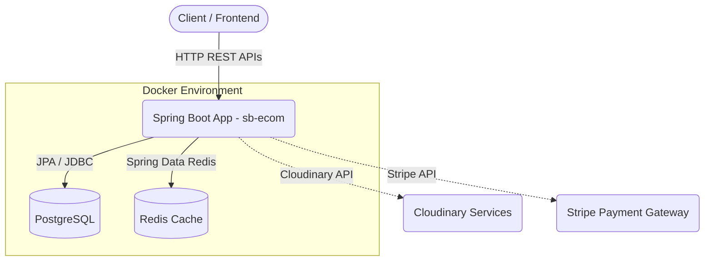

# E-commerce Application (sb-ecom)

This is a Spring Boot based e-commerce application leveraging modern Java technologies to provide a robust backend architecture for handling e-commerce operations.

## Architecture Overview

The application is built with the following main components:
- **Spring Boot Application**: The core backend application exposing REST APIs.
- **PostgreSQL**: The primary relational database for persistent storage (users, products, orders, etc.).
- **Redis**: Used as an in-memory caching layer to improve performance for frequently accessed data.
- **External Integrations**: Includes integrations with Cloudinary (for image/media management) and Stripe (for payment processing).



## Minimal Docker Setup Guide

This project includes a `Dockerfile` and a `docker-compose.yml` file to quickly spin up the application along with its dependencies (PostgreSQL and Redis) using Docker.

### Prerequisites
- [Docker](https://docs.docker.com/get-docker/) installed.
- Docker Compose (usually included with Docker Desktop).

### Running the Application

1. **Build the Java application:**
   Before running Docker, you need to build the application JAR file (since the `Dockerfile` copies it from the `target/` directory). Run the following command in the project root:
   ```bash
   # On Windows
   mvnw.cmd clean package -DskipTests

   # On Linux/macOS
   ./mvnw clean package -DskipTests
   ```

2. **Start the Docker containers:**
   Run the following command to build the Spring Boot Docker image and start all services (Spring Boot, Postgres, Redis):
   ```bash
   docker-compose up --build
   ```
   *To run the services in the background (detached mode), use:*
   ```bash
   docker-compose up -d --build
   ```

3. **Access the application:**
   Once the containers are running and the Spring Boot application has started, the API will be available at:
   `http://localhost:8080`

### Stopping the Application

To stop the running containers, use:
```bash
docker-compose down
```

**Note:** If you want to stop the containers and also remove the database volume (which will erase all your persisted Postgres data), run:
```bash
docker-compose down -v
```
